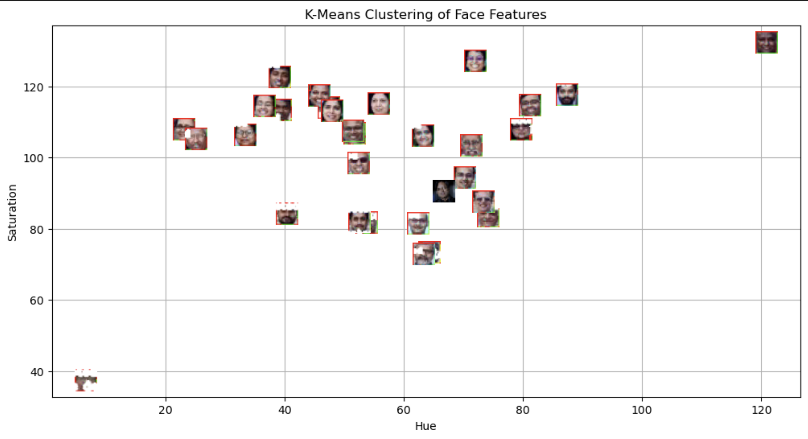
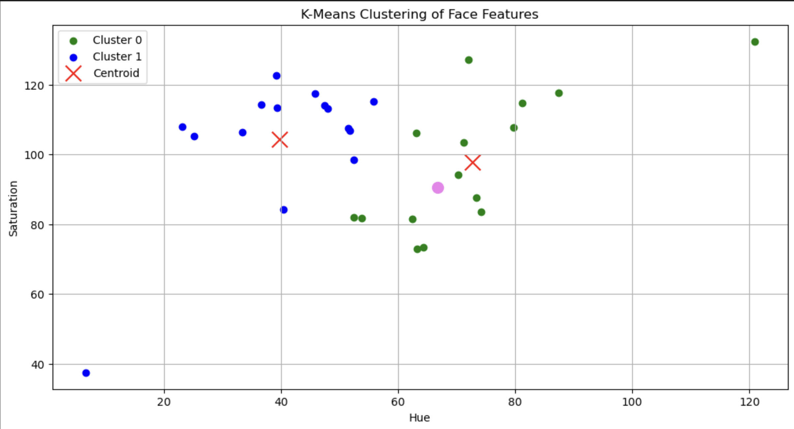

# Lab-5-mlpr

# Aim
The objective of this lab is to use distance based concepts and clustering techniques. This lab detects the faces of Plaksha's faculty members from an image. It then goes on to detect color-based features, groups them using K-means algorithm and classifies the template imaged based on its learnings. 

# Methodolgy

1. We use CV2 library to read the image. Then we convert the BGR image to grayscale for face detection.
2. The faces were detected using the Haar Cascade Classifier within the grayscale image.
3. The face boxes that were detected from the image were then converted to the HSV color space. Then, Hue and saturation of the faces was computed to depict the pictures as numerical values.
4. This Hue-saturation feature vector was then extracted and further used to assign clusters using the K-means algorithm.
5. The centroids of each cluster were calculated to represent each cluster.
6. Using the same process, a template image was used as a test subject to see how to model clusters it using K-means.
7. Scatter plots were used as a visualisation technique to analyse the clustering behaviour and classification results.

# Key Findings

1. Color based features can be used to represent faces.
2. Hue and saturation act as good parameters to ensure good faces seperation.
3. K-means algorithm successfully classified these faces based on similarity betwen the features space.
4. Template image was also successfully classified on this trained algorithm.

# Conclusion
The lab successfully demonstrated the application of facial recognition using K-means algorithm technique and distance based learning. Features like Hue and saturation were helpful in grouping and were quite reliable. This proves why feature selection is a vital part of training models.

## Results

### Face Detection

### Feature Extraction

### Clustering

### Final Classification

### Shashi tharoor

### Plaksha faculty

